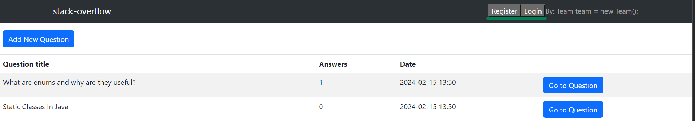
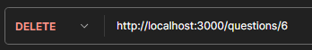

<!-- Improved compatibility of back to top link: See: https://github.com/othneildrew/Best-README-Template/pull/73 -->
<a name="readme-top"></a>
<!--
*** Thanks for checking out the Best-README-Template. If you have a suggestion
*** that would make this better, please fork the repo and create a pull request
*** or simply open an issue with the tag "enhancement".
*** Don't forget to give the project a star!
*** Thanks again! Now go create something AMAZING! :D

# Stackoverflow TW Project

## General requirements: 
- Create an SQL database to store your data
- Stick to Model View Controller layers (Frontend doesn't do calculations, only displays the data, SQL handles the data manipulation)
- Do the base data features first and add user management later, extend already existing ones if necessary 
- Aim for the code to keep SOLID, OOP and Clean code principles
- Focus on the Java & SQL parts and do minimal frontend as it is not the goal of this project
- Vanilla Javascript and HTML is suggested for frontend, nothing more complicated (like frameworks) is necessary 
- If you need new API endpoints ask mentors to create them for you

-->


<!-- PROJECT SHIELDS -->
<!--
*** I'm using markdown "reference style" links for readability.
*** Reference links are enclosed in brackets [ ] instead of parentheses ( ).
*** See the bottom of this document for the declaration of the reference variables
*** for contributors-url, forks-url, etc. This is an optional, concise syntax you may use.
*** https://www.markdownguide.org/basic-syntax/#reference-style-links
-->

<h1 align="center">Stack Overflow</h1>

<!-- ABOUT THE PROJECT -->
## About The Project

This is a learning project where we tried to recreate the famous site `Stackoverflow.com`. This is our first spring boot
application, where we had to get familiar with Annotations, Dao pattern, connecting database, and the very basics of Spring.
There are some features missing, because our main focus was to gain technical knowledge of Spring in the 3-4 days 
we had to complete this project.
<p align="right">(<a href="#readme-top">back to top</a>)</p>


### Built With
* [![Java.com]][Java-url]
* [![React.js]][React-url]
* [](https://en.wikipedia.org/wiki/JavaScript)
* [![Bootstrap.com]][Bootstrap-url]
* [![Postgres]][postgre-url]
* [![Spring]][spring-url]
<p align="right">(<a href="#readme-top">back to top</a>)</p>


<!-- GETTING STARTED -->
## Getting Started

### Prerequisites

* This is a JAVA application, so you'll need Java to run it. We used <a href="https://www.oracle.com/java/technologies/javase/jdk17-archive-downloads.html">JDK 17</a>
 for development.

### Installation

1. Clone the repo
   ```sh
   git clone https://github.com/GavallerVid/stack-overflow
   ```
2. Go to `ui` folder:
    ``` 
    cd .\src\main\ui\
    ```
3. Install NPM packages
   ```sh
   npm install
   ```
4. Create a <a href="https://www.postgresql.org/">PSQL</a> database.
5. Create the tables in the database. You can use the `stackoverflow.sql` file for this from the resources\cd folder.
6. Last you need to edit the `PSQLConnect` file's 8,9 and 10th line. You can find it in `src/main/java/com/codecool/stackoverflowtw/service`
   

<p align="right">(<a href="#readme-top">back to top</a>)</p>


<!-- USAGE EXAMPLES -->
## Usage

After finishing all the installation you should be able to start the `StackoverflowTwApplication`.
Then navigate to de ui folder and give the command `npm start`. 

If you have done every step correctly you should see something like this just without the questions. If you use the `insert.sql` from the resources you'll have similar entries.


* First you need to register (this is jost a mock authentication. We learned Spring security in a later project)
* After that you can login with the details given before.
* If you are logged in you can submit a new question 
* Clicking on the `stack-overflow` text on the nav bar will guide you back to the main page if needed.

### Question deletion 
Deletion of the questions are also possible, but we have no fornted for it yet. So for that you'll need send a `DELETE` request manually, for example from <a href="https://www.postman.com/">Postman</a>. 
* First open the question you want to delete!

* Copy the url: 
* Then copy it into postman and select the Delete method and Send the request.

* You should get a `true` in the response body, and if you refresh your main page or navigate back to it,
the question should've disappeared.
<p align="right">(<a href="#readme-top">back to top</a>)</p>

## Our Team
* [](https://github.com/GagoRobi) - Róbert Gágó <br/>
* [](https://github.com/pannaincze) - Panna Incze<br/>
* [](https://github.com/breezh) - Bence Király<br/>
* [](https://github.com/GavallerVid) - Atilla Gavallér<br/>
* [](https://github.com/MilanEgri) - Milán Egri<br/>

<!-- CONTACT -->
## Contact

#### Róbert Gágó
* [![linkedin-shield]][linkedin-url] <br/>
* ![gmail-shield] - gagorobi96@gmail.com
* [](https://github.com/GagoRobi)
<p align="right">(<a href="#readme-top">back to top</a>)</p>


<!-- MARKDOWN LINKS & IMAGES -->
<!-- https://www.markdownguide.org/basic-syntax/#reference-style-links -->
[contributors-shield]: https://img.shields.io/github/contributors/github_username/repo_name.svg?style=for-the-badge
[contributors-url]: https://github.com/github_username/repo_name/graphs/contributors
[forks-shield]: https://img.shields.io/github/forks/github_username/repo_name.svg?style=for-the-badge
[forks-url]: https://github.com/github_username/repo_name/network/members
[stars-shield]: https://img.shields.io/github/stars/github_username/repo_name.svg?style=for-the-badge
[stars-url]: https://github.com/github_username/repo_name/stargazers
[issues-shield]: https://img.shields.io/github/issues/github_username/repo_name.svg?style=for-the-badge
[issues-url]: https://github.com/github_username/repo_name/issues
[license-shield]: https://img.shields.io/github/license/github_username/repo_name.svg?style=for-the-badge
[license-url]: https://github.com/github_username/repo_name/blob/master/LICENSE.txt
[product-screenshot]: images/screenshot.png
[Next.js]: https://img.shields.io/badge/next.js-000000?style=for-the-badge&logo=nextdotjs&logoColor=white
[Next-url]: https://nextjs.org/
[React.js]: https://img.shields.io/badge/React-20232A?style=for-the-badge&logo=react&logoColor=61DAFB
[React-url]: https://reactjs.org/
[Vue.js]: https://img.shields.io/badge/Vue.js-35495E?style=for-the-badge&logo=vuedotjs&logoColor=4FC08D
[Vue-url]: https://vuejs.org/
[Angular.io]: https://img.shields.io/badge/Angular-DD0031?style=for-the-badge&logo=angular&logoColor=white
[Angular-url]: https://angular.io/
[Svelte.dev]: https://img.shields.io/badge/Svelte-4A4A55?style=for-the-badge&logo=svelte&logoColor=FF3E00
[Svelte-url]: https://svelte.dev/
[Laravel.com]: https://img.shields.io/badge/Laravel-FF2D20?style=for-the-badge&logo=laravel&logoColor=white
[Laravel-url]: https://laravel.com
[Bootstrap.com]: https://img.shields.io/badge/Bootstrap-563D7C?style=for-the-badge&logo=bootstrap&logoColor=white
[Bootstrap-url]: https://getbootstrap.com
[JQuery.com]: https://img.shields.io/badge/jQuery-0769AD?style=for-the-badge&logo=jquery&logoColor=white
[JQuery-url]: https://jquery.com
[linkedin-shield]: https://img.shields.io/badge/-LinkedIn-black.svg?style=for-the-badge&logo=linkedin&colorB=555
[linkedin-url]: https://www.linkedin.com/in/robert-gago-cc/
[gmail-shield]: https://img.shields.io/badge/Gmail-D14836?style=for-the-badge&logo=gmail&logoColor=white
[Next.js]: https://img.shields.io/badge/next.js-000000?style=for-the-badge&logo=nextdotjs&logoColor=white
[Next-url]: https://nextjs.org/
[React.js]: https://img.shields.io/badge/React-20232A?style=for-the-badge&logo=react&logoColor=61DAFB
[React-url]: https://reactjs.org/
[Bootstrap.com]: https://img.shields.io/badge/Bootstrap-563D7C?style=for-the-badge&logo=bootstrap&logoColor=white
[Bootstrap-url]: https://getbootstrap.com
[Java.com]: https://img.shields.io/badge/java-%23ED8B00.svg?style=for-the-badge&logo=openjdk&logoColor=white
[Java-url]: https://www.java.com/en/
[JavaScript]:https://img.shields.io/badge/javascript-%23323330.svg?style=for-the-badge&logo=javascript&logoColor=%23F7DF1E
[Postgres]:https://img.shields.io/badge/postgres-%23316192.svg?style=for-the-badge&logo=postgresql&logoColor=white
[postgre-url]:https://www.postgresql.org/
[MongoDB]:https://img.shields.io/badge/MongoDB-%234ea94b.svg?style=for-the-badge&logo=mongodb&logoColor=white
[mongo-url]:https://www.mongodb.com/
[Spring]:https://img.shields.io/badge/spring-%236DB33F.svg?style=for-the-badge&logo=spring&logoColor=white
[spring-url]:https://spring.io/